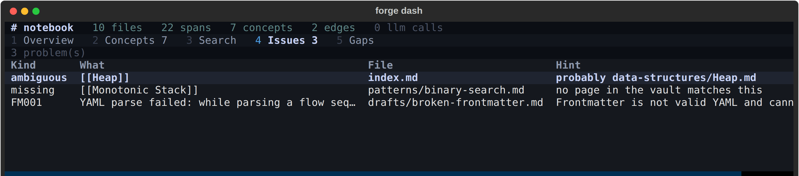

# Forge Engine

**Finds what is quietly wrong in a folder of Markdown notes.**

[](https://github.com/TarunSitaraman/forge-engine/actions/workflows/tests.yml)
[](https://pypi.org/project/forge-kb/)
[](https://pypi.org/project/forge-kb/)

```bash
pip install "forge-kb[tui]"
forge demo                       # no vault needed; writes one and finds its defects
```

Then point it at your own:

```bash
cd /path/to/your/notes
forge index && forge dash
```


## What it found the first time it ran properly

The vault this was built against has 669 indexed files and 5,373 links, and
every single one of them resolves. Zero broken links, on every report, for
months.

Then a check for pages nothing links to turned up 26 unreachable cheat sheets.
Reading them explained why: **24 of 32 pattern pages linked to the wrong
index**. Every page carried `[[Binary Search Representative Problems]]` no
matter which pattern it documented, and a cheat sheet belonging to something
else. The same wrong link sat in their frontmatter.

Every one of those links resolved. A link checker passes. Obsidian's graph view
draws a connected graph. `forge diagnostics` reported zero broken links
throughout, because they were not broken, they were wrong. Only asking *what
does nothing link to* exposed them.

That is the job: not dead links, which any tool finds, but the defects that
survive every tool because nothing about them is malformed.

It keeps finding them. On 2026-09-08, in a vault reporting zero broken links,
`Technologies/_index.md` carried this line:

```markdown
- [[Courses]] - structured learning, distinct from reference material
```

There is a `Courses/` folder. `[[Courses]]` resolved, case-insensitively, to
`Resources/courses.md`: the curated list of external courses, which is the
reference material the same line says it is distinct from. One `case_mismatch`
in 5,373 links, and the sentence around it said what it was supposed to point
at.

## What it reports

Point it at any folder of Markdown, with no model, no API key and no network:

- dead and ambiguous wikilinks, with the page each one probably meant
- frontmatter that does not parse, separately from frontmatter that is absent,
  because a note without metadata is not a defect
- pages nothing links to, counted over every page rather than over the graph
- duplicate files, convention drift, and stale cross-references



`forge dash` is the front door. It opens on your vault rather than on a prompt:
counts, the pages the graph hangs off, a concept browser, search across every
indexed page, and the problems. Every screen is deterministic, and the title bar
carries a model-call counter that stays at zero to prove it. With nothing beyond
the core install, `forge index && forge diagnostics` reports the same findings
as text.

~30,600 lines of Python, 1,477 tests that need no model, no paid API required.

## Where it is going

Everything above is deterministic and finished. The larger goal is a knowledge
base that maintains its own understanding: claims extracted from sources with
page-level provenance, a graph of what is believed and why, and a conflict
routed to a human instead of silently overwriting what came before.

That half runs end to end and is **not yet proven at scale**. The first real
extraction against this corpus was 2026-09-07. See
[`docs/roadmap.md`](docs/roadmap.md) for what is measured and what is not, and
`CLAUDE.md` for the engineering record, including the measurements that came
out wrong and what was changed because of them.

> The distribution is **`forge-kb`**; the command and the import package are
> both `forge`. The names differ because `forge-engine` on PyPI is an
> unrelated, actively maintained project.

---

## Why this exists

Forge was not built against a toy corpus. It was built against a real personal
knowledge vault of 671 Markdown files and ~58,800 lines, one canonical file
per concept, enforced by hand for a year. Then a
[full audit](docs/architecture/forge-current-state.md) measured what that
discipline actually produced:

> 145 broken wikilinks, 42% of files with no machine-readable metadata,
> 283 malformed relationship fields, stale counts in three separate files

The conventions were never wrong. They were **unenforceable by hand at that
scale**. The engine's first job is to enforce mechanically what a knowledge base
already specifies. Its later jobs follow from the same premise: a knowledge
base that cannot check itself will drift, and one that silently accepts every
new source will rot faster than one that maintains nothing.

That vault lives in a separate, private repository. This repository is the
engine on its own: the code, its engineering documentation, and its tests.

## The rules the engine is built on

These are enforced in code and asserted in tests, not stated as aspirations:

- **The vault is read-only to the engine.** Tests byte-compare every Markdown
  file before and after every operation. Derived state lives in `.forge/` and is
  rebuildable, so deleting it loses nothing of value.
- **Provenance floor.** A derived object can never claim stronger provenance
  than its weakest input. Enforced in a pydantic validator, so a violating
  object *cannot be constructed*.
- **A model may never assert `SOURCE_FACT` or `USER_ASSERTION`.** Those tiers
  belong to sources and humans.
- **Nothing is stored without evidence.** A claim whose quote cannot be found in
  its source is dropped, and the drop is reported.
- **Model reasoning never mutates knowledge directly.** It produces a proposal;
  a human approves; activation applies it.
- **Deterministic work stays deterministic.** Parsing, hashing, chunking,
  matching, graph traversal, and impact classification make **zero** LLM calls,
  and the tests assert the call count, so a future refactor cannot quietly
  introduce one.
- **No measurement claim without a measurement.** Where something could not be
  measured, [`docs/research/`](docs/research/) records it as unmeasured rather
  than estimating it.

## What it does

```bash
pip install forge-kb             # Python 3.10+

forge demo                      # a sample vault, its defects, and what finds them
forge dash                      # the dashboard: browse the vault  ("forge-kb[tui]")
forge tui                       # full-screen prompt + transcript  ("forge-kb[tui]")
forge shell                     # interactive: header bar, slash commands, history
forge serve                     # read-only API + graph explorer  ("forge-kb[api]")
forge mcp                       # the same queries, to an agent  ("forge-kb[mcp]")
forge belief "RAG"              # what you believe, and what disagrees with it
forge gaps                      # what the model does not hold, by graph query
forge changes --days 30         # what changed, read from the revision log
forge backup                    # decisions and history a rebuild cannot restore
forge index                     # deterministic index; reports "LLM calls: 0"
forge diagnostics               # every frontmatter and link defect
forge diagnostics --html r.html # a self-contained report you can send someone
forge corpus-stats              # counts from the filesystem, never from a doc
forge ingest paper.pdf          # spans carrying page + section provenance
forge search "chunking"         # evidence with citations, not generated prose
forge ask "what is RAG?"        # one model call, every statement cited
forge proposals list            # what Forge would change, awaiting your call
forge activate                  # approved proposals -> canonical knowledge
forge concept "RAG"             # what Forge knows, and which page proved it
forge graph path A B            # how two concepts connect
forge extract-plan              # what would this run cost? zero model calls
forge retrieval-eval            # measured retrieval quality, not a claim
forge evolve paper-b.pdf        # how does this paper affect what I know?
forge workflow inspect <id>     # why did Forge propose that?
```

Point it at a vault with `FORGE_VAULT_PATH=/path/to/vault`, or per command with
`forge index --vault /path/to/vault`. Forge refuses to guess: if it cannot
locate a vault it says so rather than indexing whatever directory you happen to
be standing in.

**Conflict handling is the load-bearing feature.** When a new paper disagrees
with something Forge already believes, it does not overwrite it and does not
quietly accept it. It reports a *potential conflict*, shows you the page that
prompted it, and waits. Approve, and the original claim is marked disputed with
the new evidence attached. It is never rewritten and never retracted. The run
replays afterwards with `forge workflow inspect`.

Ambiguous concepts are never merged silently either. A collision is documented
and left ambiguous until a human decides, and the decision is then persisted in
a `config/concept-identity.yaml` versioned alongside the vault it describes.

## Measured, including the negative results

Retrieval quality is evaluated against a labelled 24-query / 48-label set, not
asserted:

| Method | R@5 | R@10 | MRR | Latency |
|---|---:|---:|---:|---:|
| lexical (FTS5/BM25) | 0.510 | 0.685 | 0.535 | **11 ms/q** |
| **hybrid (w=0.50)** | **0.574** | **0.699** | **0.604** | 860 ms/q |

Re-baselined 2026-09-01 with the full sweep: two methods, four fusion weights,
deterministic embedder, byte-identical on re-run. **This reversed the earlier
finding.** Embeddings were built, measured and rejected in Phase 3, when every
fusion weight regressed; on the current corpus every weight improves.

It still ships lexical-only, and the reason is now cost rather than quality:
**78x the latency for +0.064 R@5**, on a 24-query set where that is a handful
of documents moving rank. Two things changed under the old measurement at once:
the corpus lost the engine's `docs/`, and the chunker took spans from 1,692 to
7,118. The cause is therefore not attributed. [The numbers, and what they do not
license](docs/research/retrieval-baseline.md).

Extraction quality has its own eval, and its headline metric is deliberately
**junk rate rather than recall**, because the failure mode this corpus actually
has is over-extraction and recall rewards that. A test pins the choice: an
extractor emitting every noun phrase scores 1.0 recall and is still correctly
judged bad. First trustworthy run, on `openai/gpt-oss-120b` with prompt
`0.3.0` and all 6 cases completed: **junk 0.000, recall 0.472, grounding 1.000** over 23 claims.
Read [the caveats](docs/research/extraction-cost.md) before quoting any of it;
0.000 means "no known failure recurred", not "no junk".

Two of this project's own metrics shipped broken and are written up rather than
quietly fixed: a grounding score that **could only ever print 1.000** because it
re-checked claims already filtered by the identical rule, and an eval that
scored timed-out runs as clean because nothing emitted cannot be junk. **A
metric that cannot fail is worse than no metric, because it reassures.**

**No paid API is required.** Providers are pluggable and open-weights all the
way down: Ollama locally or over a private network, any OpenAI-compatible
endpoint (Groq, OpenRouter, vLLM, llama.cpp, LM Studio) for machines that cannot
host a model, a scripted provider for CI, and a proprietary API only if you
happen to want one. Because a quality result belongs to a model rather than to
Forge, provenance records which provider and model produced every assessment,
and changing either means re-running the evaluation rather than inheriting the
old number.

## Status

**Phases 0-4, 6 and 8-10 have passed every gate they declared.** The engine
indexes a corpus deterministically, ingests external PDFs and Markdown with
page- and section-level provenance, turns everything it infers into proposals a
human decides on, activates approved ones into canonical knowledge you can
traverse and cite, evaluates how new evidence changes what it already knows,
and serves all of it through a dashboard, a read-only HTTP API and an MCP
server.

Two things are open, and neither is finished work being described as done.
**Phase 5** still has two gates unticked: extraction has run against this
corpus but has not been scored against its 545 filename-derived concepts, so
the knowledge half is demonstrated rather than measured at scale. **Phase 7**,
an Obsidian plugin, is not started. See [`docs/roadmap.md`](docs/roadmap.md),
where every gate is ticked or not.

```bash
forge demo                       # the end-to-end story, in a vault it writes
python -m pytest tests           # 1,477 tests, no model needed
bash scripts/validate_phase4.sh  # proves the phase's exit criteria by running them
```

In this repository 1,435 pass and 42 skip: those 42 are integration tests that
run against the private Markdown vault, and they skip when it is not checked
out. Point them at a checkout to run the full 1,477:

```bash
FORGE_TEST_VAULT=/path/to/forge python -m pytest tests
```

The suite is otherwise complete and requires no model. CI and every test run
**offline** against a scripted provider.

## Layout

| Path | What |
|---|---|
| `engine/forge/domain/` | Pure domain model. No storage, no HTTP, no LLM. |
| `engine/forge/corpus/`, `parsing/` | Deterministic vault indexing and Markdown parsing. |
| `engine/forge/sources/`, `ingestion/` | PDF/Markdown acquisition, chunking into spans. |
| `engine/forge/extraction/`, `matching/` | LLM candidate extraction; concept matching. |
| `engine/forge/proposals/`, `activation/` | Proposed changes; approved changes becoming canonical. |
| `engine/forge/graph/`, `retrieval/` | SQLite knowledge graph; FTS5 search. |
| `engine/forge/evolution/` | LangGraph workflow evaluating new evidence against existing knowledge. |
| `engine/forge/llm/` | Provider abstraction: ollama / cloud / mock. |
| `docs/` | Engineering documentation: architecture, ADRs, research, test strategy. |
| `tests/`, `scripts/` | 1,477 tests; demos and per-phase validation scripts. |

Start with [`docs/`](docs/README.md): the
[current-state audit](docs/architecture/forge-current-state.md),
[ADR-001](docs/decisions/001-forge-knowledge-os.md), the
[CLI reference](docs/cli.md), and the per-phase implementation notes.

## Install

```bash
pip install forge-kb             # Python 3.10+
```

See what it does before you point it at anything of yours. No model, no API
key, no network, no configuration:

```bash
forge demo
```

Then point it at any folder of Markdown:

```bash
cd /path/to/your/notes
forge index
forge diagnostics
```

The distribution is `forge-kb`; the command and the import package are both
`forge`. The names differ because `forge-engine` on PyPI is an unrelated,
actively maintained project.

Optional extras: `forge-kb[tui]` for the full-screen interface,
`forge-kb[vectors]` for static word-vector embeddings, `forge-kb[agent]` for
the LangGraph evolution workflow. None are needed to index or diagnose.

**To work on the engine itself:**

```bash
git clone https://github.com/TarunSitaraman/forge-engine.git
cd forge-engine
pip install -e ".[dev]"          # Python 3.10+
```

Per-machine provider configuration lives in `~/.config/forge/forge.env`;
[`config/forge.env.example`](config/forge.env.example) is the template, and
`forge status` reports which settings file was loaded and which model is
actually active. Note that the model ids in that example rotate faster than the
file does, so verify one is live before trusting it.

## License

MIT. See [`LICENSE`](LICENSE).
