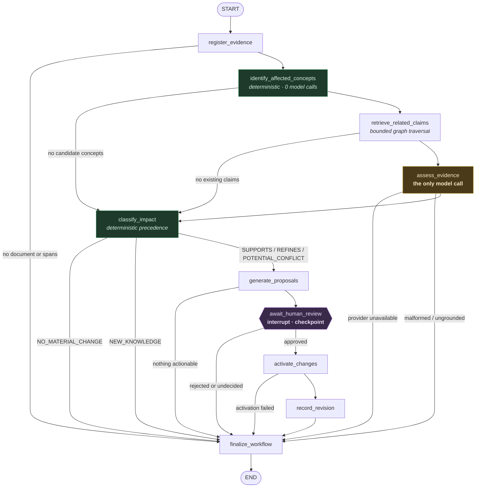

# Phase 4 — Agentic Knowledge Evolution Engine

*What was built, how it behaves, and what it deliberately refuses to do.
Describes the implementation as it exists.*

**Status:** implemented · **Tests:** 737 passing · **LLM required:** no (CI is offline)
**Validate:** `bash scripts/validate_phase4.sh`

---

## 1. Why Phase 4 exists

Phases 1–3 built a system that could take knowledge *in*:

```
SOURCE -> INGEST -> EXTRACT -> PROPOSE -> APPROVE -> ACTIVATE -> CANONICAL KNOWLEDGE
```

Every arrow only ever added. Nothing in Forge could look at a new paper and ask
the question a person asks immediately: **"does this change what I already
believed?"**

Phase 4 adds that:

```
NEW EVIDENCE -> UNDERSTAND -> IDENTIFY AFFECTED KNOWLEDGE -> RETRIEVE CLAIMS
  -> ASSESS -> CHOOSE ACTION -> PROPOSE -> HUMAN REVIEW -> ACTIVATE
  -> REVISION -> PROVENANCE
```

> Forge does not merely store new information. Forge evaluates how new
> information changes what it already knows.

---

## 2. What is actually agentic here

Not "it uses LangGraph". The agentic property is the loop and its ability to
stop itself:

| Step | Where |
|---|---|
| Observe new evidence | `register_evidence` |
| Inspect existing knowledge | `identify_affected_concepts`, `retrieve_related_claims` |
| Reason about the relationship | `assess_evidence` — the only model call |
| Decide what should happen | `classify_impact` — deterministic policy |
| Propose an action | `generate_proposals` |
| **Stop for a human when policy requires it** | `await_human_review` |
| Resume from persisted state | LangGraph checkpoint + `EvolutionService.resume` |
| Execute the approved change | `activate_changes` |
| Record the consequence | `record_revision`, provenance on every entity |

There is **one** workflow, not a committee. No supervisor, no agent per node, no
agents negotiating. A second agent would add coordination failure modes without
adding a decision anything actually needs.

---

## 3. Why LangGraph is justified

**LangGraph is orchestration, not the intelligence itself.**

Every node is a thin adapter over a service that is plain Python and
individually testable with the framework uninstalled. Nothing in
`forge/evolution/workflow.py` parses, chunks, hashes, searches, traverses,
validates provenance, or classifies safety. Delete the file and every rule
about grounding, provenance, and approval still holds.

What the framework genuinely provides, each of which the workflow needs:

| Requirement | Why a plain function was not enough |
|---|---|
| Persistent state | The run must survive the process exiting mid-review. |
| Conditional routing | Seven of ten nodes can end the run early. |
| Interruption | `await_human_review` stops the graph, not just the function. |
| Resumability | A resumed run continues; it does not restart. |
| Checkpoints | Semantic work already paid for is never repeated. |
| Retries | Bounded, per node. |

It is also a **dependency, not a foundation**: LangGraph is an optional extra
(`pip install -e '.[agent]'`), imported lazily. `forge index`, `ingest`,
`search`, `activate`, `graph`, and `proposals` all work on a clone that never
installs it, and asking for `forge evolve` without it produces an actionable
error rather than an ImportError traceback.

---

## 4. The graph



Green nodes are deterministic and free. The single amber node is the only place
a token is spent. The purple node is where the workflow stops and waits for a
person.

Note how many edges reach `finalize_workflow` directly: "this evidence does not
affect anything you know" is the common case, and it must cost nothing. On
unrelated evidence the run ends after three deterministic nodes having made
**zero** model calls — asserted in
`test_unrelated_evidence_never_reaches_the_model`.

---

## 5. State schema

`EvolutionState` is a `TypedDict`, checkpointed after every node. Two rules
shape it:

**It must serialize.** No services, connections, or domain objects — anything
that cannot round-trip breaks the first resume.

**It must not carry the corpus.** State holds *identifiers*; nodes resolve them
against the store when they need content. Embedding span text and claim objects
would checkpoint megabytes per step and, worse, go stale — a resumed run would
act on a snapshot of knowledge rather than knowledge as it now is.

| Group | Fields |
|---|---|
| identity | `workflow_id`, `source_id`, `source_locator`, `document_id` |
| evidence | `evidence_span_ids`, `evidence_hash` |
| narrowing | `candidates`, `affected_concept_ids`, `related_claim_ids` |
| reasoning | `assessments`, `assessment_outcome`, `impact` |
| decision | `proposal_ids`, `approval_status`, `approved_proposal_ids` |
| effect | `activated_entity_ids`, `revision_ids` |
| provider | `provider_id`, `model_id`, `prompt_version`, `schema_version` |
| execution | `status`, `llm_calls`, `cache_hits/misses`, `node_log`, `warnings`, `errors` |

The one exception to "ids only" is `candidates` and `assessments`, stored as
small dicts. They are *outputs* of the run rather than copies of the knowledge
base, and losing them on resume would mean paying for the model calls twice.

### Two records, deliberately

| | LangGraph checkpoint | `WorkflowRun` |
|---|---|---|
| Owner | the orchestrator | Forge |
| Purpose | resumption | history |
| Lifetime | prunable | permanent |
| Survives LangGraph removal | no | yes |
| Answers | "where was I?" | "why did Forge propose this?" |

`forge workflow inspect` reads the second, so inspection works even with the
orchestrator uninstalled.

---

## 6. Deterministic narrowing

**The LLM is never handed the corpus and asked what is relevant.** It is handed
a small, already-justified candidate set. That is a cost decision — scanning 600
documents per call is unaffordable — but mostly a groundedness decision: a model
asked "what does this affect?" answers fluently and unverifiably, while "does
this bear on *this* claim?" can be checked.

Selectors, cheapest and most certain first. Every candidate records which one
found it and why:

| Selector | Basis |
|---|---|
| `exact_name` | The concept's canonical name appears in the evidence. |
| `alias` | A registered alias appears in the evidence. |
| `identity` | A user-decided collision identity matched. |
| `heading` | The name appears in a heading of the new document. |
| `lexical` | FTS5/BM25 surfaced the concept's own material. |
| `graph_neighbour` | One bounded hop from an already-selected concept. |

Embeddings are **not** consulted by default: Phase 3 measured them as a
retrieval regression ([`../research/retrieval-baseline.md`](../research/retrieval-baseline.md)),
and switching them on here without new evidence would contradict a measurement.

Claim retrieval is bounded twice — per concept and overall — because forty
claims in one prompt produces forty shallow judgements. `SUPERSEDED` and
`RETRACTED` claims are excluded; `DISPUTED` ones are deliberately kept, since a
claim flagged as doubtful is still live knowledge that later evidence may
support or sharpen.

---

## 7. Semantic assessment

The only place Forge genuinely reasons. Four rules, all enforced in code rather
than requested in the prompt:

**1. Grounding.** Every cited span id must be one actually shown to the model
*and* present in the store. A citation to anything else means the assessment is
rejected — never repaired. Repairing a hallucinated citation would mean
fabricating the evidence for a knowledge change. Both failure shapes are
tested: an invented id, and a real id the model was not shown.

**2. Conservatism.** The vocabulary is:

| Class | Meaning |
|---|---|
| `SUPPORTS` | The evidence independently backs the claim as stated. |
| `REFINES` | Broadly right, but the evidence sharpens or conditions it. |
| `POTENTIAL_CONFLICT` | The evidence appears to disagree. **Routes to a human.** |
| `IRRELEVANT` | No bearing. |
| `INSUFFICIENT_EVIDENCE` | Touches the topic without settling it. |

There is deliberately **no `CONTRADICTS`**. A false contradiction costs more
trust than a missed one: the first makes a user distrust everything Forge
asserts, the second only leaves them where they were. `INSUFFICIENT_EVIDENCE`
is a first-class outcome, not a failure — a model forced to choose among
substantive options will pick one, so giving it an honest way to decline is
what keeps the others meaningful.

**3. No silent downgrade.** If the configured provider is unavailable, the
result is `SEMANTIC_ANALYSIS_UNAVAILABLE` and the run stays resumable. Forge
does not quietly ask a weaker model whether your knowledge is wrong.

**4. Identity is recorded.** Provider, model, prompt version, and schema version
travel with every assessment and all four are in its derivation key. An
assessment is not a fact about the world; it is a fact about what *that model*
concluded under *those instructions*.

---

## 8. Impact classification

Deterministic, by design. The model judges one claim; deciding what that means
for the knowledge base is a policy question, and nine lines of precedence rules
answer it without a second call, a second failure mode, or a second thing to
audit.

It also protects a guarantee that should not depend on a generated token: **one
`POTENTIAL_CONFLICT` dominates any number of `SUPPORTS`**, so a run containing
a single possible disagreement always reaches a human.

| Impact | When |
|---|---|
| `POTENTIAL_CONFLICT` | any assessment conflicts |
| `REFINES` | else any refines |
| `SUPPORTS` | else any supports |
| `NEW_KNOWLEDGE` | no existing claim was even related — a finding, not a non-event |
| `NO_MATERIAL_CHANGE` | claims existed, none affected |

**No confidence scores.** A number a model emits about its own certainty is not
a measurement, and attaching one would make the output look calibrated when it
is not.

---

## 9. Proposals and activation

Model reasoning never mutates canonical knowledge. Assessments become proposals
in the **existing** Phase 2/3 proposal system — not a parallel one, so there is
one review queue and one approval path.

| Assessment | Proposal | On activation |
|---|---|---|
| `SUPPORTS` | `CLAIM_EVIDENCE` (model_generated) | Attaches an `INFERS_FROM` link. Statement untouched. |
| `REFINES` | `CLAIM_REFINEMENT` (model_generated) | New claim; old one **superseded**, retained, `SUPERSEDE` revision. |
| `POTENTIAL_CONFLICT` | `CLAIM_CONFLICT` (**ambiguous**) | Claim marked `DISPUTED`, evidence attached. **Never retracted, never rewritten.** |
| `IRRELEVANT` / `INSUFFICIENT_EVIDENCE` | none | — |

Conflicts are classified `AMBIGUOUS`, which makes Phase 3's batch-approval
guard refuse to bulk-approve them without an explicit flag. That guard was
built for a different reason and turns out to be exactly right here.

`INFERS_FROM` is used rather than `QUOTES` throughout: the model concluded the
span bears on the claim; it did not establish that the claim's words appear in
the span. Phase 1 forbids a model asserting a verbatim quote, and that
constraint applies here unchanged.

---

## 10. Human-in-the-loop

`await_human_review` calls LangGraph's `interrupt()`. The run persists and the
process may exit.

Approval happens through `forge proposals approve` — the one approval
mechanism. On resume the node re-reads each proposal's **actual stored status**
rather than trusting the resume payload, so a resume cannot smuggle in a
decision nobody recorded.

**Resuming with nothing decided pauses again** rather than falling through. A
resume is not consent, and a workflow that quietly completed with its proposals
still pending would report success for a decision nobody made. This is bounded
by `MAX_REVIEW_ROUNDS` so a scripted caller cannot loop forever.

---

## 11. Provider architecture

```
LLMProvider (protocol)
 ├── OllamaProvider    local or LAN-remote, configurable base_url
 ├── CloudProvider     anthropic | openai-compatible wire formats
 └── MockProvider      deterministic, the CI default
```

Selection is configuration; nothing above `forge.llm` branches on the vendor.
The knowledge model, workflow, proposals, and activation are identical
whichever provider answered.

**The deployment reality this serves:** Forge runs on an 8 GB Intel MacBook that
cannot practically host an 8B model. A GPU laptop can, but is not always on. So:

| Path | Configuration |
|---|---|
| Self-hosted, free | `FORGE_LLM_PROVIDER=ollama` |
| Model on another box | `FORGE_LLM_PROVIDER=ollama FORGE_OLLAMA_URL=http://host:11434` |
| Portable | `FORGE_LLM_PROVIDER=cloud ANTHROPIC_API_KEY=...` |

**No paid API is ever required.** The self-hosted path is complete.

**Credentials are never stored.** Configuration names an environment variable;
the key is read at call time and never written to config, the database,
provenance, or logs. `health()` reports a credential's presence without
revealing it — tested.

### Failure behaviour

| Condition | Result |
|---|---|
| No credential / unreachable host | `ProviderUnavailable` → `SEMANTIC_ANALYSIS_UNAVAILABLE` |
| 401 / 403 | `ProviderUnavailable`, **not retried** into a rate limit |
| 4xx (other) | `LLMError`, not retried |
| 429 / 5xx | Bounded retries, then `LLMError` |
| Malformed structured output | One repair attempt, then `StructuredOutputError` |

### Provider identity on resume

A run paused under one model and resumed under another is not the same run.
`resume()` refuses by default and requires `--allow-provider-change`, which
records the change as a warning on the run. Mixing judgements from two models
with no way to tell which said what is exactly the silent provenance ambiguity
the brief forbids.

---

## 12. Caching and cost control

Derivation key for one assessment:

```
evidence content hash + claim id + processor version
                      + provider|model + prompt version + schema version
```

Changing any component recomputes. Note `model_id` carries the *provider*: two
providers serving the same model name are still two different things.

**Only `assess_evidence` spends a call** — asserted by node-level accounting,
not by inspection. Narrowing, retrieval, impact classification, proposal
construction, and activation are all deterministic and all verified to make
zero calls.

Measured on the demo: first run 1 call; re-run **0 calls, 1 cache hit**, and
identical revision, claim, evidence, and proposal counts.

---

## 13. Failure modes

| Condition | Outcome | Resumable |
|---|---|---|
| Model unavailable | `SEMANTIC_ANALYSIS_UNAVAILABLE` | yes |
| Malformed structured output | `ASSESSMENT_REJECTED` → workflow `FAILED` | yes |
| Missing / hallucinated evidence | `ASSESSMENT_REJECTED` (per assessment) | yes |
| Provider timeout | `RETRYABLE_FAILURE` → workflow `FAILED` | yes |
| Storage failure during activation | `FAILED`; proposal stays `APPROVED` | yes |
| Human rejection | `PROPOSAL_REJECTED`; run completes, knowledge unchanged | n/a |
| LangGraph not installed | `OrchestratorUnavailable` with an install hint | n/a |

**No failure is ever converted into an empty successful result.** Tested
explicitly: three different provider failures, each asserted not to report
success.

---

## 14. Observability

Every node records duration, LLM calls, cache hits/misses, retries, and
failure. `forge workflow inspect` is the "why did Forge propose this?" command,
printing: which concepts were considered *and the selector that found each*,
which claims were examined, what the model concluded and on which spans, which
proposals resulted, what a human decided, which revisions followed, and what it
all cost.

---

## 15. Known limitations

- **The local path has been smoke-tested, not characterised.** Qwen3 8B scored
  5/5 on the assessment set (2026-08-14) with perfect structured-output
  validity and perfect grounding, including both adversarial cases. But five
  cases cannot establish a classification rate, and "0 false positives out of 2
  adversarial cases" is not a false-positive rate. The cloud path remains
  entirely unmeasured. See
  [`../research/provider-availability.md`](../research/provider-availability.md) §6.
- **Local latency is a real constraint.** 63 s/case on an RTX 4050, with one
  call exceeding the default 120 s timeout and retrying. Raise
  `FORGE_LLM_TIMEOUT` before long runs on comparable hardware.
- **The assessment evaluation set is 5 cases.** Enough to check the pipeline's
  behaviour per classification; far too small to characterise a model.
- **Relevance narrowing has no LLM refinement step.** The brief permits one;
  it was not built, because with no real model available there was no way to
  measure whether it helped.
- **Only claim-level evolution.** New evidence cannot yet refine a *concept*,
  create a relationship, or retire one.
- **One source per run.** Evidence spanning several new documents is assessed
  document by document.
- **`NEW_KNOWLEDGE` is reported, not acted on.** Forge notes that the evidence
  is about something it does not know, but Phase 2 extraction remains the way
  to add it.

---

## Related

- [`phase-3-implementation.md`](phase-3-implementation.md) — activation, identity, graph, retrieval
- [`../research/provider-availability.md`](../research/provider-availability.md) — what could and could not be measured
- [`../research/retrieval-baseline.md`](../research/retrieval-baseline.md) — why embeddings are off by default
- [`../knowledge-model/canonical-model.md`](../knowledge-model/canonical-model.md) — the entities being evolved
- [`../cli.md`](../cli.md) — command reference
